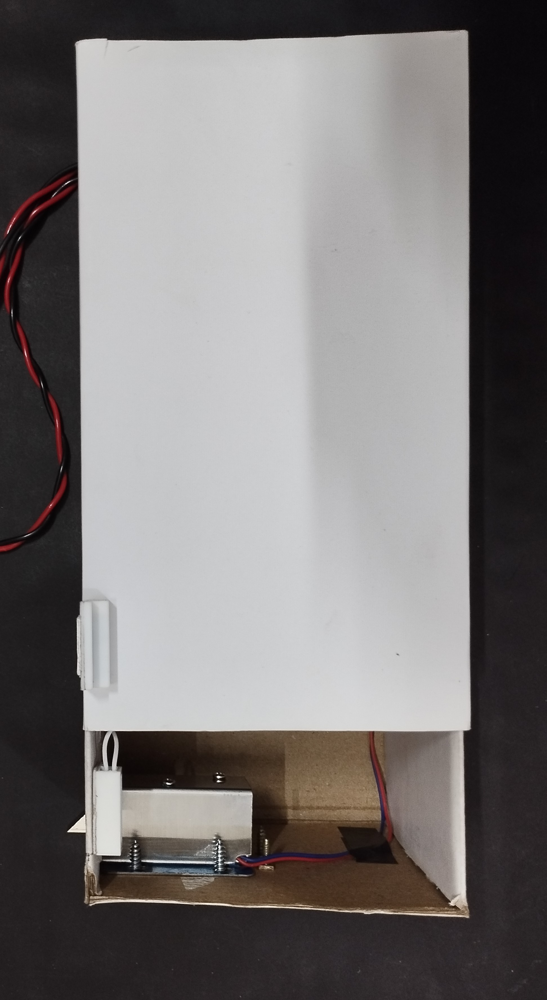

# Introduction
The NexGuard RFID Lock System with RFID Access and Email Notification is an advanced security solution designed to safeguard door access and protect valuable assets such as jewelry, cash money, documents, and other similar items. leveraging modern technologies. Central to its operation is the integration of RFID (Radio-Frequency Identification) technology, reed switch sensors, and email notification capabilities. The system comprises essential components including an ESP8266 microcontroller module, an RFID reader, a reed switch sensor, a solenoid lock, and a buzzer. With this system, authorized users are granted access to the secured area by simply tapping an RFID card embedded with a unique tag. Upon detection of the authorized tag, the system activates the solenoid lock, granting access to the premises. In the event of an unauthorized attempt, where an invalid RFID tag is detected, the system promptly triggers a buzzer alarm. Simultaneously, an email notification is sent to a predefined email address, providing real-time updates on the unauthorized access attempt. Furthermore, the system incorporates a reed switch sensor to monitor the state of the door. If the door is opened without a valid RFID access, signifying a potential intrusion, the system promptly triggers a buzzer alarm to alert nearby individuals and sends an email notification to notify the user of the security breach. By combining access control mechanisms with intrusion detection capabilities and remote notifications via email, the NexGuard RFID Lock System offers comprehensive security measures, ensuring the safety and protection of the premises. Its seamless integration of modern technologies empowers users with real-time insights into access events, enhancing overall security and providing peace of mind.

# Prototype

[Watch the video](NexGuard/NexGuard_Working_Video.mp4)
   
